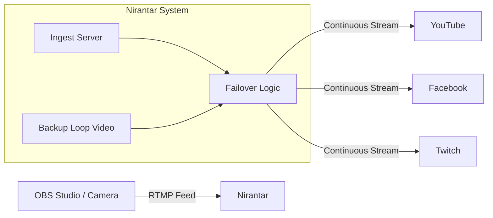

# Nirantar (ਨਿਰੰਤਰ) 🟢

**The Always-On Livestream Guardian**

> *An autonomous, always-on livestreaming system that ensures your stream never goes offline. Built for Gurdwaras, Temples, and Community Institutions.*


---

## 📖 About

**Nirantar** (meaning "Eternal" or "Continuous") is an open-source, fail-safe streaming system designed for institutions where presence matters—Gurdwaras, Temples, Mosques, and Community Radio stations.

Unlike standard OBS setups that go black (offline) when the internet drops or the computer crashes, **Nirantar automatically switches to a backup "Simran/Loop" video instantly**, ensuring your channel is **always live, 24/7**. When your main feed returns, it seamlessly switches back.

### Why Nirantar?
- **Zero Downtime**: Viewers never see a black screen or "Stream Offline" message.
- **Peace of Mind**: Automated failover means you don't need a dedicated operator staring at the screen.
- **Professional**: Maintains your YouTube/Facebook algorithm ranking by keeping the stream active.

---

## ✨ Key Features

- 🛡️ **Auto-Failover Protection**: Detects silence/loss of feed and switches to backup loop immediately.
- 📡 **Multi-Destination Streaming**: Send one feed to Nirantar, and it restreams to YouTube, Facebook, Twitch, and custom RTMP targets simultaneously.
- 🎛️ **Central Command Dashboard**: A modern, secure web interface to manage stream keys and monitor system health.
- 🔄 **Smart Recovery**: Automatically switches back to the live feed when it becomes stable.
- 🔒 **Role-Based Security**: Secure access for committees and volunteer teams (Admin/Operator roles).
- ✉️ **Alerts**: Email notifications for system events (optional).

---

## 🚀 Quick Start

### Prerequisites
- **Docker** & **Docker Compose**
- A machine with at least 4GB RAM (8GB recommended)
- 10GB Disk Space

### Installation (3 Steps)

1. **Clone the repository**
   ```bash
   git clone https://github.com/Shital-AI/Nirantar.git
   cd Nirantar
   ```

2. **Run the Setup Script**
   This script will check requirements and generate secure credentials for you.
   ```bash
   ./setup.sh
   ```

3. **Login**
   - **URL**: `http://localhost:3002`
   - **Default Email**: `admin@livestream.local`
   - **Default Password**: `admin123` *(Change this immediately!)*

---

## 🎬 How It Works



1. **You stream from OBS** to Nirantar (`rtmp://your-server:1935/live`).
2. **Nirantar checks quality**: If the feed is good, it goes to YouTube.
3. **If Internet Drops**: Nirantar cuts to the **Backup Video** stored on the server.
4. **When Internet Returns**: It waits for stability, then cuts back to **Live**.

---

## � Configuration

### OBS Setup
- **Service**: Custom
- **Server**: `rtmp://<YOUR_SERVER_IP>:1935/live`
- **Stream Key**: *(Copy from Nirantar Dashboard)*

### SMTP (Email) Setup
Configure email alerts in the dashboard:
1. Go to **Config** → **Email** tab.
2. Enter your SMTP details (Gmail/Outlook/etc).
3. Save to enable password resets and alerts.

---

## 🏗️ Architecture

| Service | Port | Description |
|---------|------|-------------|
| **Web Admin** | `3002` | Next.js Dashboard UI |
| **Controller** | `8080` | Go-based Logic & API |
| **SRS** | `1935` | High-performance RTMP Server |
| **PostgreSQL** | `5432` | Database |

---

## 🤝 Contributing

We welcome contributions from the community (Sangat)! 
1. Fork the repo
2. Create your feature branch (`git checkout -b feature/amazing-feature`)
3. Commit your changes (`git commit -m 'Add some amazing feature'`)
4. Push to the branch (`git push origin feature/amazing-feature`)
5. Open a Pull Request

---

## 📄 License

This project is licensed under the **MIT License** - see the [LICENSE](LICENSE) file for details.

---

<div align="center">
  <p>Built with ❤️ for the Community</p>
  <p>
    <a href="https://github.com/Shital-AI/Nirantar">GitHub</a> • 
    <a href="#">Website</a> • 
    <a href="#">Support</a>
  </p>
</div>